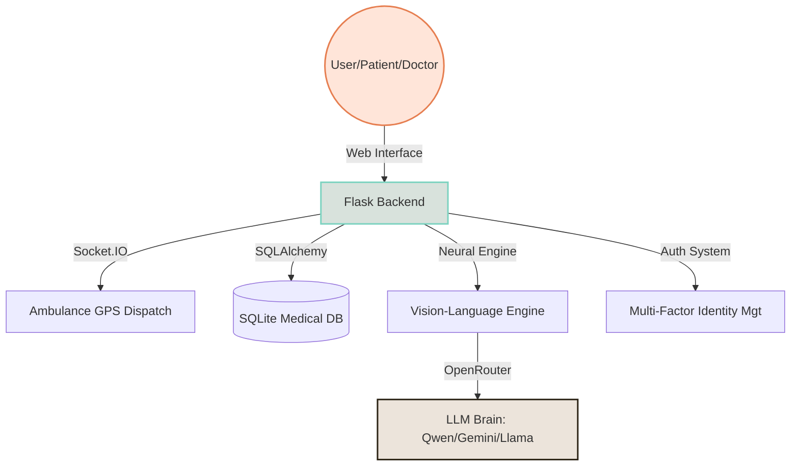

# MedDigit AI: High-Precision Medical Digitization & Emergency Ecosystem 🏥✨


MedDigit AI is a cutting-edge healthcare platform engineered to bridge the gap between traditional medical records and modern digital intelligence. By leveraging **Neural OCR**, **Vision AI**, and **Real-Time WebSockets**, MedDigit AI provides a seamless, high-precision environment for patients, doctors, and emergency responders.

---

## 📑 Table of Contents
1. [🚀 System Architecture](#-system-architecture)
2. [✨ Core Features](#-core-features)
3. [🔐 Multi-Identity Access & Roles](#-multi-identity-access--roles)
4. [🛠️ Technology Stack](#-technology-stack)
5. [⚙️ Installation & Setup](#-installation--setup)
6. [🏃 Quick Start Guide](#-quick-start-guide)
7. [🌐 Deployment](#-deployment)
8. [⚖️ Disclaimer & License](#-disclaimer--license)

---

## 🚀 System Architecture



---

## ✨ Core Features

### 🚑 Real-Time Ambulance Dispatch (SOS)
*   **One-Tap Emergency Protocol**: Instantly notifies the nearest ambulance driver with live GPS data and patient triage information.
*   **WebSocket Interconnect**: Low-latency communication ensures that critical emergency data is shared in milliseconds.
*   **Dynamic Response Tracking**: Patients can monitor ambulance proximity in real-time on interactive maps.

### 📝 Neural OCR & Clinical Digitization
*   **Vision AI Analysis**: High-precision extraction of medical data from prescriptions, lab reports, and imaging documents.
*   **Automated Summarization**: Converts complex medical jargon into easy-to-understand patient summaries and clinical insights.
*   **Structured Medical Vault**: All digitized records are securely stored and indexed for rapid retrieval by authorized healthcare professionals.

### 🤖 specialized Medical Intelligence (AI Chatbot)
*   **Clinical Guardrails**: A specialized AI assistant trained to provide medical guidance while strictly adhering to safety protocols (refuses non-medical queries).
*   **Intelligent Routing**: Uses high-performance models (Gemini 2.0, Qwen 2.5) via OpenRouter for maximum accuracy and uptime.

### 🔍 Healthcare Scheme Intelligence
*   **Matching Engine**: Automatically matches patient medical profiles with eligible government health schemes (e.g., Ayushman Bharat, Arogyasri).

---

## 🔐 Multi-Identity Access & Roles

| Role | Key Capabilities | Business Value |
| :--- | :--- | :--- |
| **👨‍⚕️ Doctor** | Deep Clinical History, AI Insights, Record Management | Enhanced diagnostic accuracy via structured longitudinal data. |
| **🏥 HCW** | Rapid Digitization, Patient Intake Registry | Streamlined clinical operations and zero-paper workflows. |
| **🚑 Driver** | Live Emergency Queue, Map Navigation | Minimized response times for critical care delivery. |
| **👤 Patient** | Digital Health Vault, SOS, Scheme Discovery | Patient-centric data ownership and rapid emergency access. |

---

## 🛠️ Technology Stack

*   **Backend**: Python 3.11, Flask, WebSockets (Flask-SocketIO)
*   **AI/ML**: Neural OCR, Vision-Language Models (VLM), NLP via OpenRouter
*   **Database**: SQLAlchemy ORM with SQLite (PostgreSQL compatible)
*   **Frontend**: Modern Glassmorphic UI, Vanilla JS, CSS3, HTML5
*   **Mapping**: Leaflet.js / OpenStreetMaps

---

## ⚙️ Installation & Setup

1.  **Clone the Repository**:
    ```bash
    git clone https://github.com/hemadrik2006-cyber/meddigitAi.git
    cd meddigitAi
    ```
2.  **Environment Setup**:
    ```bash
    python -m venv venv
    source venv/bin/activate  # On Windows: venv\Scripts\activate
    pip install -r requirements.txt
    ```
3.  **API Configuration**:
    Configure your `OPENROUTER_API_KEY` in the application environment to activate AI features.

---

## 🏃 Quick Start Guide

Run the application locally using the optimized startup scripts:
```powershell
# Windows
.\start_meddigit.ps1
```
The application will be accessible at `http://127.0.0.1:8080`.

---

## 🌐 Deployment

Ready for one-click deployment to **Render** via `render.yaml`:
- **Build**: `pip install -r requirements.txt`
- **Start**: `gunicorn -k geventwebsocket.gunicorn.workers.GeventWebSocketWorker -w 1 app:app --bind 0.0.0.0:$PORT`

---

## ⚖️ Disclaimer & License

> [!CAUTION]
> This platform is for clinical decision support. Final medical decisions must always be made by a qualified professional.

Licensed under the **MIT License**.

---
&copy; April 26, 2026 MedDigit AI | Engineering for Life.
